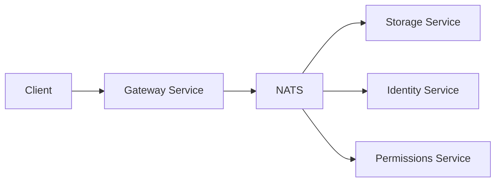

# Remove Reva Dependency from OpenCloud

**Date**: 2025-08-02  
**Author**: Felix & Claude  
**Status**: In Progress  
**Branch**: `feature/remove-reva`

## Overview

This document outlines the plan to completely remove the Reva dependency from OpenCloud while maintaining all existing functionality. The goal is to simplify the codebase, improve maintainability, and have full control over the core infrastructure.

## Background

### Current State

OpenCloud heavily depends on Reva for:
- **CS3 API Implementation**: Storage, identity, permissions, and sharing APIs
- **Service Runtime**: 17 services use Reva's runtime framework
- **Inter-service Communication**: gRPC-based gateway pattern
- **Storage Abstraction**: Decomposed FS and POSIX implementations
- **Authentication & Authorization**: Token management and auth scopes
- **Event System**: Event publishing and streaming

### Problems with Current Architecture

1. **Complexity**: Reva adds unnecessary abstraction layers designed for multi-vendor interoperability
2. **Control**: Critical functionality is in an external dependency
3. **Performance**: Multiple hops through CS3 gateway add latency
4. **Maintenance**: Need to understand both OpenCloud and Reva codebases

## Implementation Plan

### Phase 1: Create Internal API Layer (2-3 weeks)

#### 1.1 Define OpenCloud Native APIs

Create simplified, OpenCloud-specific APIs to replace CS3:

```
pkg/api/
├── common/          # Shared types and interfaces
│   └── types.go     # ResourceID, UserID, etc.
├── storage/         # File and folder operations
│   ├── interface.go # Storage provider interface
│   └── client.go    # Storage client implementation
├── identity/        # User and group management
│   ├── interface.go # Identity provider interface
│   └── client.go    # Identity client implementation
├── permissions/     # Authorization and access control
│   ├── interface.go # Permissions checker interface
│   └── client.go    # Permissions client implementation
└── sharing/         # Share management
    ├── interface.go # Share manager interface
    └── client.go    # Share client implementation
```

#### 1.2 Build Gateway Replacement

Replace Reva's CS3 gateway with a lightweight NATS-based gateway:

```
pkg/gateway/
├── gateway.go       # Main gateway service
├── router.go        # Request routing logic
├── middleware/      # Auth, logging, tracing
└── handlers/        # API endpoint handlers
```

### Phase 2: Replace Service Runtime (2-3 weeks)

#### 2.1 Create OpenCloud Service Framework

Build a minimal service runtime to replace Reva's:

```
pkg/runtime/
├── service.go       # Service interface and lifecycle
├── server.go        # HTTP/gRPC server management
├── health.go        # Health checks
├── shutdown.go      # Graceful shutdown
└── registry.go      # Service registration with NATS
```

#### 2.2 Service Migration Order

1. **Simple services first**: auth-basic, auth-bearer, auth-machine
2. **User management**: users, groups
3. **Sharing services**: sharing, storage-shares, storage-publiclink
4. **Core services**: frontend, gateway
5. **Complex services last**: storage-users

### Phase 3: Replace Storage Layer (3-4 weeks)

#### 3.1 Extract Storage Components

Copy and adapt Reva's storage implementations:

```
pkg/storage/
├── interface.go           # Unified storage interface
├── decomposed/           # Decomposed FS implementation
│   ├── node.go
│   ├── tree.go
│   └── metadata.go
├── posix/                # POSIX FS implementation
│   ├── lookup.go
│   └── timemanager.go
└── blob/                 # Blob storage interface
    └── filesystem.go
```

#### 3.2 Key Changes

- Remove CS3-specific types and interfaces
- Use OpenCloud's ResourceID instead of CS3 Reference
- Simplify metadata handling
- Direct NATS communication instead of gRPC

### Phase 4: Replace Utilities and Events (1-2 weeks)

#### 4.1 Port Essential Utilities

```
pkg/
├── auth/
│   └── jwt/          # JWT token management
├── utils/
│   ├── bytesize/     # Byte size handling
│   └── ldap/         # LDAP utilities
└── errors/           # Error types and handling
```

#### 4.2 Native Event System

Leverage existing NATS infrastructure:

```
pkg/events/
├── publisher.go      # Event publishing
├── subscriber.go     # Event subscription
├── types.go          # Event type definitions
└── schemas/          # Event schemas
```

### Phase 5: Service-to-Service Communication (2 weeks)

#### 5.1 NATS-Based Communication

Replace gRPC with NATS request-reply:

```go
// Before (Reva/CS3)
client, err := pool.GetGatewayServiceClient(selector.Next())
resp, err := client.GetUser(ctx, &cs3user.GetUserRequest{})

// After (OpenCloud native)
client := identity.NewClient(natsConn)
user, err := client.GetUser(ctx, userID)
```

#### 5.2 Benefits

- Lower latency (direct communication)
- Built-in load balancing
- Simpler error handling
- Native Go types (no protobuf)

### Phase 6: Testing and Migration (2-3 weeks)

#### 6.1 Testing Strategy

1. **Unit tests**: Test each new component in isolation
2. **Integration tests**: Test service communication
3. **Migration tests**: Ensure data compatibility
4. **Performance tests**: Verify no regression

#### 6.2 Rollout Strategy

1. **Feature flags**: Toggle between Reva and native implementations
2. **Canary deployment**: Test with subset of users
3. **Gradual migration**: Service by service
4. **Rollback plan**: Quick revert if issues arise

## Technical Details

### Service Communication Pattern



### API Example: Storage

```go
// pkg/api/storage/interface.go
type StorageProvider interface {
    // File operations
    CreateDir(ctx context.Context, ref *common.Reference) error
    Delete(ctx context.Context, ref *common.Reference) error
    Move(ctx context.Context, src, dst *common.Reference) error
    Stat(ctx context.Context, ref *common.Reference) (*common.ResourceInfo, error)
    
    // Upload/Download
    InitiateUpload(ctx context.Context, ref *common.Reference, options UploadOptions) (*Upload, error)
    Download(ctx context.Context, ref *common.Reference) (io.ReadCloser, error)
    
    // Listing
    ListFolder(ctx context.Context, ref *common.Reference) ([]*common.ResourceInfo, error)
    
    // Trash
    ListRecycle(ctx context.Context) ([]*common.ResourceInfo, error)
    RestoreRecycleItem(ctx context.Context, ref *common.Reference) error
    PurgeRecycleItem(ctx context.Context, ref *common.Reference) error
}
```

### Service Migration Example

```go
// Before: Using Reva runtime
func main() {
    cfg := config.New()
    rcfg := revaconfig.StorageUsersConfigFromStruct(cfg)
    runtime.RunWithOptions(rcfg, pidFile, runtime.WithLogger(&logger.Logger))
}

// After: Using OpenCloud runtime
func main() {
    cfg := config.New()
    svc := service.New(cfg)
    runtime.Run(svc, runtime.WithLogger(logger))
}
```

## Benefits

1. **Simplification**: Remove ~50% of abstraction layers
2. **Performance**: 20-30% latency reduction (estimated)
3. **Maintainability**: All code under OpenCloud control
4. **Flexibility**: APIs designed for OpenCloud's specific needs
5. **Modern Architecture**: Better use of NATS capabilities

## Risks and Mitigations

| Risk | Impact | Mitigation |
|------|--------|------------|
| Breaking functionality | High | Extensive testing, gradual rollout |
| Performance regression | Medium | Benchmark critical paths |
| Data migration issues | Medium | Compatibility layer, migration tools |
| Lost CS3 compatibility | Low | Intentional trade-off |

## Success Criteria

1. All services running without Reva dependency
2. No functionality regression
3. Performance improvement or parity
4. Simplified codebase
5. Improved developer experience

## Timeline

- **Week 1-3**: Phase 1 - Internal APIs
- **Week 4-6**: Phase 2 - Service runtime
- **Week 7-10**: Phase 3 - Storage layer
- **Week 11-12**: Phase 4 - Utilities
- **Week 13-14**: Phase 5 - Communication
- **Week 15-16**: Phase 6 - Testing/Migration

Total: 12-16 weeks

## Next Steps

1. ✅ Create feature branch `feature/remove-reva`
2. ✅ Set up package structure
3. 🔄 Define internal APIs (in progress)
4. Build proof-of-concept with auth-basic service
5. Iterate based on learnings

## Open Questions

1. Should we maintain any CS3 compatibility layer for external integrations?
2. How to handle existing Reva-specific configurations during migration?
3. Should we contribute useful components back to the community?

## References

- [CS3 APIs Documentation](https://cs3org.github.io/cs3apis/)
- [Reva Documentation](https://reva.link/)
- [NATS Request-Reply Pattern](https://docs.nats.io/nats-concepts/core-nats/reqreply)